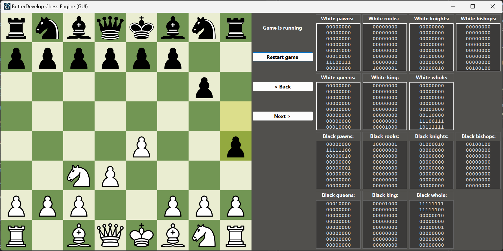

# ButterDevelopChessEngine



## Table of Contents

- [Introduction](#introduction)
- [Features](#features)
- [Installation](#installation)
- [Usage](#usage)
- [Project Structure](#project-structure)
- [Contributing](#contributing)
- [License](#license)
- [Contact](#contact)

## Introduction

**ButterDevelopChessEngine** is a powerful and flexible chess engine developed in **C#** with a user-friendly graphical interface built using **WinForms**.
Designed for both enthusiasts and developers, this open-source project offers robust AI capabilities, an intuitive UI, and a clean codebase for further enhancements and integrations.

## Features

- **Advanced AI**: Implements sophisticated algorithms for challenging gameplay.
- **Intuitive GUI**: User-friendly interface for seamless interaction.
- **Modular Architecture**: Clean separation of concerns with Controllers and Models.
- **Cross-Platform Support**: Built on .NET 6.0, ensuring compatibility across various platforms.
- **Customizable Resources**: Easily replaceable chess piece images and UI elements.

## Installation

### Prerequisites

- **.NET 6.0 SDK**: Ensure you have the .NET 6.0 SDK installed. You can download it from [here](https://dotnet.microsoft.com/download/dotnet/6.0).
- **Visual Studio 2022** or any other compatible IDE for C# development.

### Steps

1. **Clone the Repository**

   ```bash
   git clone https://github.com/YourUsername/ButterDevelopChessEngine.git
   ```

2. **Navigate to the Project Directory**

   ```bash
   cd ButterDevelopChessEngine
   ```

3. **Build the Solution**
   Open the solution file ButterDevelopChessEngine.sln in Visual Studio and build the project, or use the .NET CLI:
   ```bash
   dotnet build
   ```

## Usage

**After building the project, you can run the chess engine with its graphical interface.**

### Running the GUI

1. **Navigate to the GUI Directory**

   ```bash
   cd GUI
   ```

2. **Run the Application**

   ```bash
   dotnet run
   ```
Alternatively, you can launch the GUI.exe found in the GUI/bin/Debug/net6.0-windows directory.

### Playing a Game

- **Launch the application.**
- **Choose your preferred settings.**
- **Start playing against the AI or another player**

## Project Structure

```bash
ButterDevelopChessEngine/
├── bin/
│   └── Debug/
│       └── net6.0/
├── Controllers/
│   ├── AIController.cs
│   ├── BitCalculations.cs
│   ├── EvaluationController.cs
│   ├── MoveMaskController.cs
│   └── VerificationController.cs
├── Models/
│   ├── Board.cs
│   └── Move.cs
├── obj/
│   └── Debug/
│       └── net6.0/
└── GUI/
    ├── bin/
    │   └── Debug/
    │       └── net6.0-windows/
    ├── obj/
    │   └── Debug/
    │       └── net6.0-windows/
    ├── Properties/
    └── Resources/
        ├── black_bishop.png
        ├── black_king.png
        ├── ...
        └── white_rook.svg
```

- **ButterDevelopChessEngine:** Core engine containing Controllers and Models.
- **GUI:** WinForms application for the graphical user interface.
- **bin/** and **obj/**: Compiled binaries and object files.
- **Resources/**: Image assets for chess pieces and logos.

## Contributing

Contributions are welcome! Please follow these steps to contribute:

1. **Fork the Repository**
2. **Create a Feature Branch**
   ```bash
   git checkout -b feature/YourFeature
   ```
3. **Commit Your Changes**
   ```bash
   git commit -m "Add Your Feature"
   ```
4. **Push to the Branch**
   ```bash
   git push origin feature/YourFeature
   ```
5. **Open a Pull Request**

Please ensure your code follows the project's coding standards and includes relevant tests.

## License

This project is licensed under the **MIT License**. You are free to use, modify, and distribute this software as per the license terms.

## Contact

For any inquiries or feedback, please contact me here, on GitHub.


**Happy Chess Playing! ♟️**